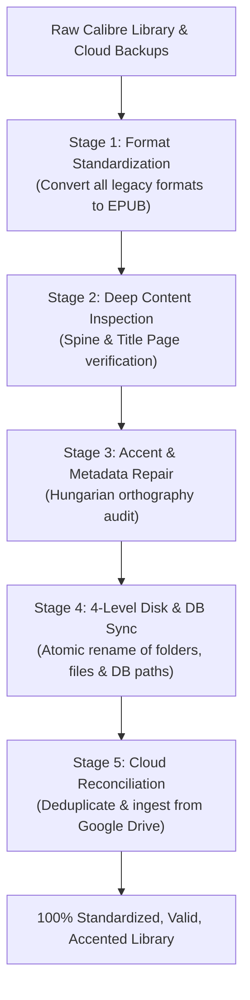

# Calibre Library Auditor & Accent Pipeline

A production-tested, multi-stage engineering pipeline designed to audit, standardize, and repair large-scale Calibre ebook libraries (8,000+ volumes). It ensures books are strictly maintained in valid UTF-8 EPUB format, verifies internal text content against metadata, restores authentic Hungarian accents, and synchronizes filesystem names with the Calibre database.

---

## Core Pillars & Standards

### 1. The 4-Level Consistency Architecture
Every book entry must strictly match across four independent levels:
1. **Calibre Database (`metadata.db`):** `books.title`, `authors.name`, `books.path`, `data.name`.
2. **Metadata Sidecar (`metadata.opf`):** `<dc:title>`, `<dc:creator>`, `<dc:language>`.
3. **Disk Directory (Folder):** `<Author>/<Title (id)>/` preserving authentic Unicode accents.
4. **Disk File (.epub):** `<Title> - <Author>.epub` preserving authentic Unicode accents.

### 2. Authentic Hungarian Orthography & Accent Preservation
- **Strict Accented Alphabet:** `á, é, í, ó, ö, ő, ú, ü, ű` (and capitals `Á, É, Í, Ó, Ö, Ő, Ú, Ü, Ű`).
- **Elimination of Transliterated ASCII Slugs:** Calibre's default behavior converts Hungarian characters into ASCII (e.g. `Jokai Mor` instead of `Jókai Mór`). This pipeline overrides transliteration and enforces real Unicode paths on disk.
- **Elimination of Wavy / Corrupted Accents:** Detect and fix wavy umlauts (`õ, û, ô`), Latin-1 / CP1250 double-encoding artifacts (mojibake like `á`, `ő`), and legacy OCR errors.

### 3. Deep Internal Book Inspection (Title Page & Spine)
Never trust superficial file metadata alone. Ebooks often have misleading metadata generated during scraping or scanning.
- **EPUB Spine Extraction:** Inspect the first XHTML/HTML spine items (cover, titlepage, half-title, colophon).
- **Text Normalization:** Strip HTML/CSS tags, decode XML entities, and parse the true author and work title.
- **Discrepancy Resolution:** Flag and correct books where internal text diverges from the database title (e.g., hash stubs like `u6b1g629` -> `Zsömle odavan` by Krasznahorkai László).

### 4. Zero Legacy Format Policy (100% Valid EPUB Only)
- Convert all legacy document formats (`.doc`, `.docx`, `.rtf`, `.html`, `.txt`) into standard EPUB 3 / EPUB 2.
- **Pure-Python Binary OLE Extraction:** When legacy Microsoft Word `.doc` files suffer from corrupt macro headers or trigger COM security crashes in Word, extract text directly from raw 512-byte OLE sector streams (`WordDocument` stream scanning for UTF-16LE and CP1250 text runs).

### 5. SMB / NAS Safe SQLite & Filesystem Concurrency
- **Read-Only Connections:** Open remote SMB SQLite databases using URI mode: `file:///W:/calibre/metadata.db?mode=ro` with `timeout=60.0`.
- **Local Staging for Bulk Mutations:** For massive database operations across network shares, stage `metadata.db` on local SSD, apply transactions with registered Calibre user functions (`title_sort`, `sort_css`, `uuid4`), verify integrity via `PRAGMA integrity_check`, and atomically write back.
- **Filesystem Sanitization for Windows/NTFS/SMB:** Strip Windows reserved characters (`\ / : * ? " < > |`) and strictly strip trailing spaces and dots (`.rstrip('. ')`), preventing Win32 `[WinError 3]`.

---

## Pipeline Workflow



---

## Included Automation Scripts

Located in the `scripts/` directory:

1. **`audit_4_levels.py`**
   Audits the entire library and generates a comprehensive report of discrepancies between database records, OPF files, disk directory paths, and EPUB file names.

2. **`inspect_book_content.py`**
   Opens EPUB archives, traverses spine documents, parses HTML headers and paragraphs, and extracts authentic internal book title and author data.

3. **`sync_accented_library.py`**
   Performs atomic two-phase filesystem synchronization. Renames directories and files to authentic Hungarian accented paths while updating Calibre's `books.path` and `data.name` tables.

4. **`doc_ole_to_epub.py`**
   Direct binary parser for legacy Word `.doc` files. Recovers paragraph text from damaged OLE compound documents without Microsoft Office dependencies and packages clean, valid EPUBs.

5. **`reconcile_gdrive.py`**
   Recursively discovers EPUB files across Google Drive storage, deduplicates against existing Calibre IDs and title hashes, and stages new acquisitions for import.

---

## Verification & Quality Assurance

Always run verification before and after library operations:
```powershell
# Check database integrity
python -c "import sqlite3; conn = sqlite3.connect('file:///W:/calibre/metadata.db?mode=ro', uri=True); print(conn.cursor().execute('PRAGMA integrity_check').fetchall())"

# Audit accent defects
python scripts/audit_4_levels.py --library "W:\calibre"
```
